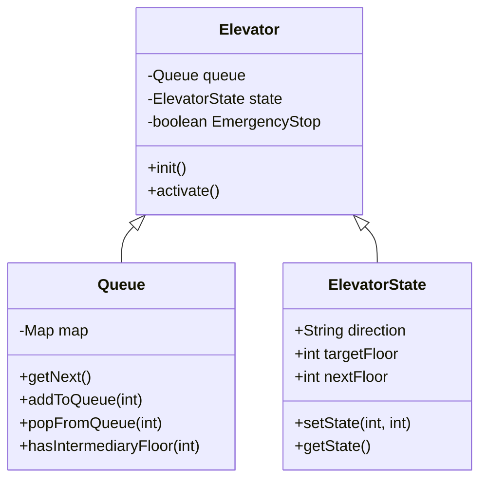

# Diagram illustrations using mermaid

```mermaid
%% Class Diagram
classDiagram
    Elevator <|-- Queue
    Elevator <|-- ElevatorState
    class Elevator{
      -Queue queue
      -ElevatorState state
      -boolean EmergencyStop
      +init()
      +activate()
    }

    class Queue{
      -Map map
      +getNext()
      +addToQueue(int)
      +popFromQueue(int)
      +hasIntermediaryFloor(int)
    }

    class ElevatorState{
      +String direction
      +int targetFloor
      +int nextFloor
      +setState(int, int)
      +getState()
    }
```
