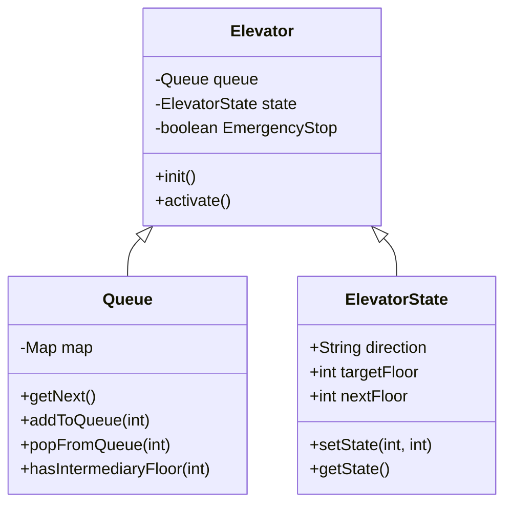
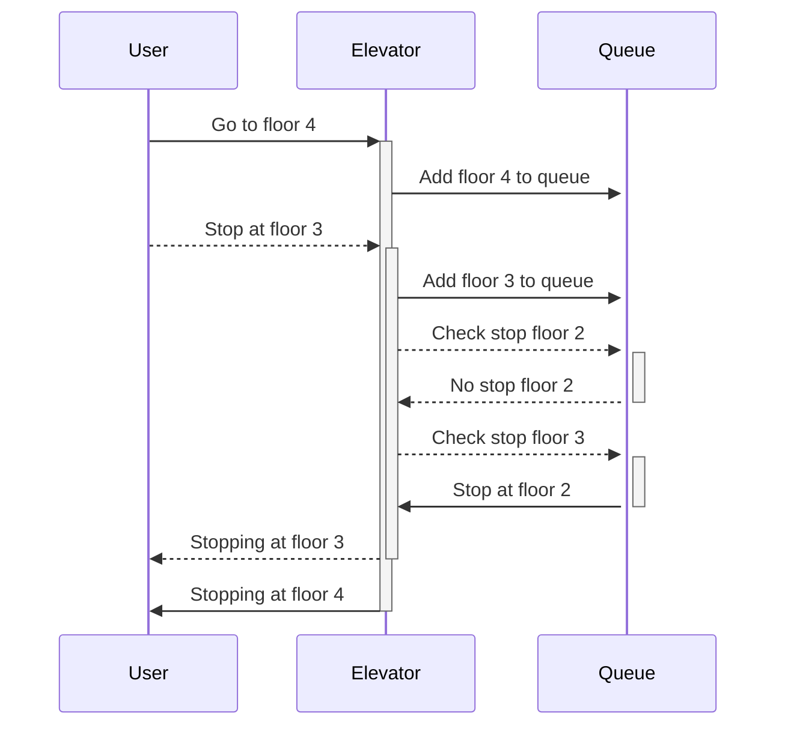

# Diagram illustrations using mermaid

## Class diagram

```mermaid
classDiagram
    Elevator <|-- Queue
    Elevator <|-- ElevatorState
    class Elevator{
      -Queue queue
      -ElevatorState state
      -boolean EmergencyStop
      +init()
      +activate()
    }

    class Queue{
      -Map map
      +getNext()
      +addToQueue(int)
      +popFromQueue(int)
      +hasIntermediaryFloor(int)
    }

    class ElevatorState{
      +String direction
      +int targetFloor
      +int nextFloor
      +setState(int, int)
      +getState()
    }
```

## Sequence diagram

### User at floor 1 wishes to go to floor 4

```mermaid
sequenceDiagram
    User->>+Elevator: Go to floor 4
    Elevator->>+Queue: Add floor 4 to queue
    User-->>+Elevator: Stop at floor 3
    Elevator->>+Queue: Add floor 3 to queue
    Elevator-->>+Queue: Check stop floor 2
    Queue-->>-Elevator: No stop floor 2
    Elevator-->>+Queue: Check stop floor 3
    Queue->>-Elevator: Stop at floor 2
    Elevator-->>-User: Stopping at floor 3
    Elevator->>-User: Stopping at floor 4
```
