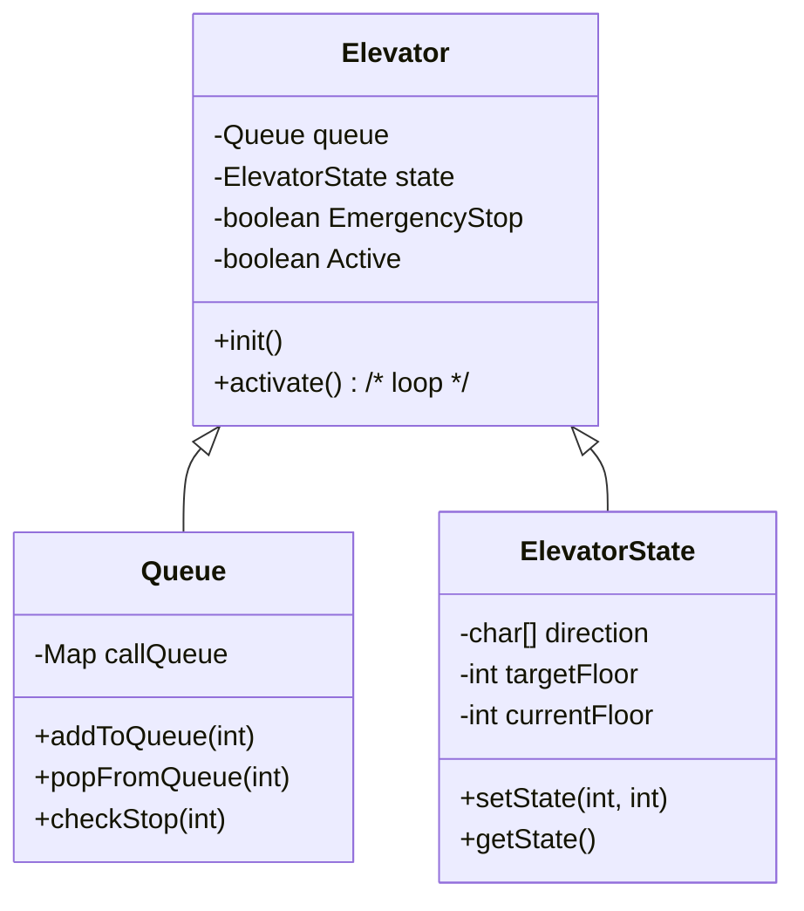
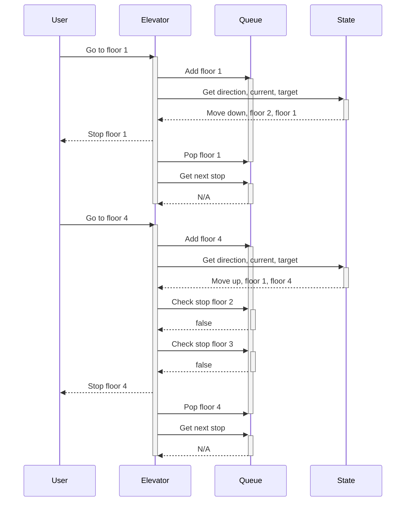
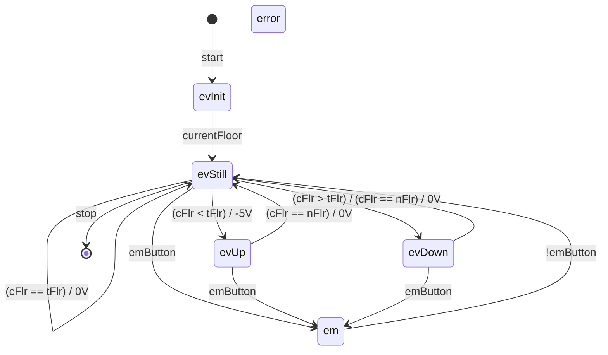
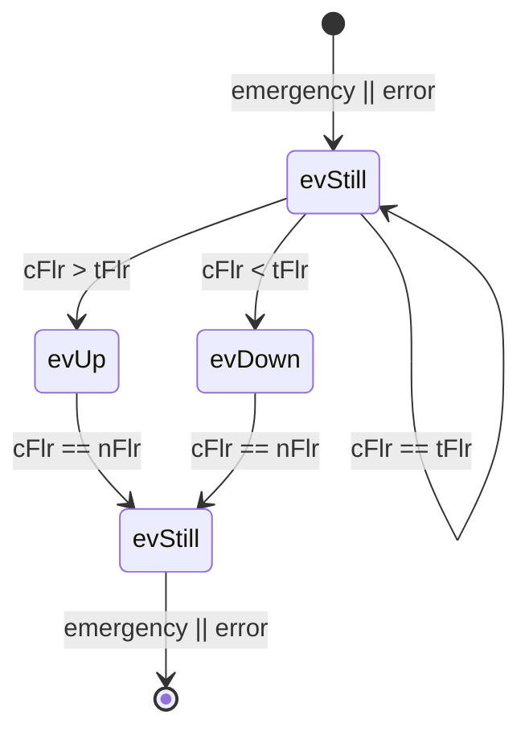
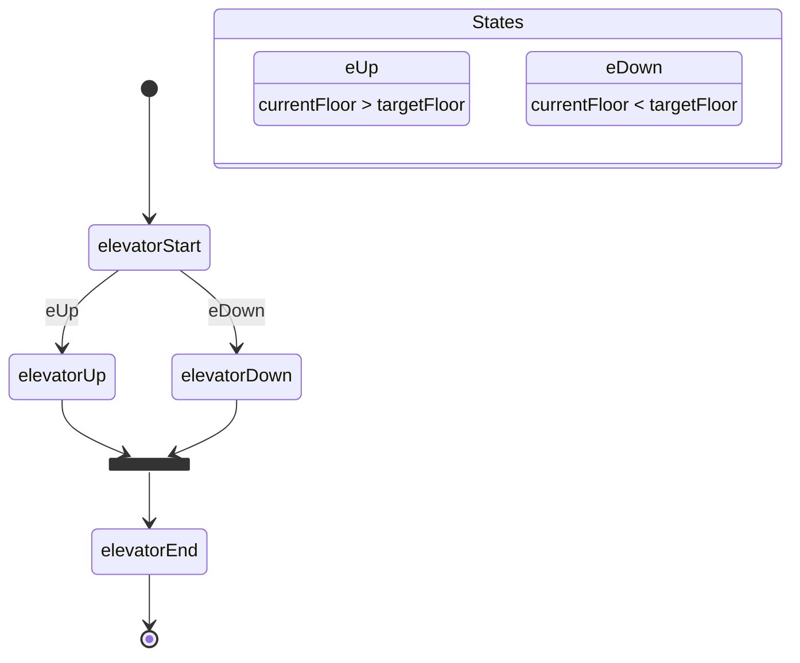

# Diagram illustrations using mermaid

## Class diagram

```mermaid
classDiagram
    Elevator <|-- Queue
    Elevator <|-- ElevatorState
    class Elevator{
      -Queue queue
      -ElevatorState state
      -boolean EmergencyStop
      -boolean Active
      +init()
      +activate() /* loop */
    }

    class Queue{
      -Map callQueue
      +addToQueue(int)
      +popFromQueue(int)
      +checkStop(int)
    }

    class ElevatorState{
      -char[] direction
      -int targetFloor
      -int currentFloor
      +setState(int, int)
      +getState()
    }
```

## Sequence diagram

```mermaid
sequenceDiagram
    participant User
    participant Elevator
    participant Queue
    participant State
    User->>Elevator: Go to floor 1
    activate Elevator
    Elevator->>Queue: Add floor 1
    activate Queue
    Elevator->>+State: Get direction, current, target
    State-->>-Elevator: Move down, floor 2, floor 1
    Elevator-->>User: Stop floor 1
    Elevator->>Queue: Pop floor 1
    deactivate Queue
    Elevator->>+Queue: Get next stop
    Queue-->>-Elevator: N/A

    deactivate Elevator
    User->>Elevator: Go to floor 4
    activate Elevator
    Elevator->>Queue: Add floor 4
    activate Queue
    Elevator->>+State: Get direction, current, target
    State-->>-Elevator: Move up, floor 1, floor 4
    Elevator->>+Queue: Check stop floor 2
    Queue-->>-Elevator: false
    Elevator->>+Queue: Check stop floor 3
    Queue-->>-Elevator: false
    Elevator-->>User: Stop floor 4
    Elevator->>Queue: Pop floor 4
    deactivate Queue
    Elevator->>+Queue: Get next stop
    Queue-->>-Elevator: N/A
    deactivate Elevator

```

## Finite State Machine

```mermaid

stateDiagram-v2
  [*]-->evInit: start

  evInit-->evStill: currentFloor

  evStill-->evStill: (cFlr == tFlr) / 0V

  evStill-->evUp: (cFlr < tFlr) / -5V

  evStill-->[*]: stop

  evStill-->evDown: (cFlr > tFlr) / +5V

  evUp-->evStill: (cFlr == nFlr) / 0V

  evDown-->evStill: (cFlr == nFlr) / 0V

  evStill-->em: emButton
  evUp-->em: emButton
  evDown-->em: emButton
  em-->evStill: !emButton

  error

```

## fsm

```mermaid

stateDiagram-v2
  s1: evStill
  [*]-->s1: emergency || error

  s1-->s1: cFlr == tFlr
  s1-->evDown: cFlr < tFlr
  s1-->evUp: cFlr > tFlr
  s2: evStill
  evUp-->s2: cFlr == nFlr

  evDown-->s2: cFlr == nFlr

  s2-->[*]: emergency || error


```

```mermaid


stateDiagram
      [*] --> elevatorStart
      elevatorStart --> elevatorUp: eUp
      elevatorStart --> elevatorDown: eDown


      state join_state <<join>>
      elevatorUp --> join_state
      elevatorDown --> join_state
      join_state --> elevatorEnd
      elevatorEnd --> [*]

      state States {
        s1: eUp
        s1: currentFloor > targetFloor
        s2: eDown
        s2: currentFloor < targetFloor
      }
```
